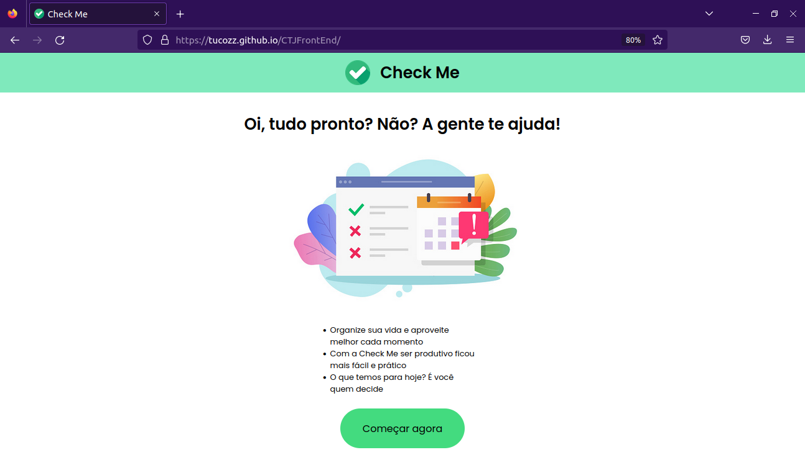

# CTJFrontEnd

<!-- PROJECT LOGO -->
<br />
<div align="center">
  <a href="https://github.com/tucozz/CTJFrontEnd">
    
  </a>

<h3 align="center">Check Me</h3>

  <p align="center">
    Trabalho em conjunto para processo seletivo da CT Junior disponível para visualização em: https://tucozz.github.io/CTJFrontEnd/
    <br />
    <a href="https://github.com/tucozz/CTJFrontEnd"><strong>Explore a documentação »</strong></a>
    <br />
    <br />
    <a href="https://www.figma.com/file/xMpQgKhkHshfgWMmIWAAxT/CT-JUNIOR?node-id=0%3A1">. Projeto do design</a>
  </p>
</div>


<!-- TABLE OF CONTENTS -->
<details>
  <summary>Índice</summary>
  <ol>
    <li>
      <a href="#Sobre-o-projeto">Sobre o projeto</a>
      <ul>
        <li><a href="#Feito com">Feito com</a></li>
      </ul>
    </li>
    <li>
      <a href="#Primeiros-passos">Primeiros passos</a>
      <ul>
        <li><a href="#Pre-requisito">Pré-requisito</a></li>
        <li><a href="#Instalacao">Instalação</a></li>
      </ul>
    </li>
    <li><a href="#Uso">Uso</a></li>
    <li><a href="#Licenca">Licença</a></li>
    <li><a href="#Contato">Contato</a></li>
    <li><a href="#Agradecimentos">Agradecimentos</a></li>
  </ol>
</details>

<!-- ABOUT THE PROJECT -->
## Sobre o projeto

<div align="center">
    
</div>

Trata-se de um web app de lista de afazeres requisitado pela contratante Klien Criente.

<p align="right">(<a href="#readme-top">voltar ao topo</a>)</p>


### Feito com

* HTML
* CSS
* Javascript


<p align="right">(<a href="#readme-top">voltar ao topo</a>)</p>


<!-- GETTING STARTED -->
## Primeiros passos


### Pre requisito

Git Propriamente instalado e inicializado.

### Instalacao
Descrito um passo a passo de como iniciar a aplicação e utilizá-la:

1. Clone o repositório
   ```sh
   git clone https://github.com/tucozz/CTJFrontEnd
   ```
2. Dentro da pasta copiada, execute o arquivo 'index.html'
   ```sh
   ./index.html
   ```


## Uso

Use esta aplicação para gerênciar suas tarefas de forma prática e eficiente. Com fácil acesso a areas de criação, edição e remoção de tarefas, Check Me funciona com Local Storage para que suas tarefas não sejam perdidas e faz com que sua rotina fique muito mais organizada.

<p align="right">(<a href="#readme-top">voltar ao topo</a>)</p>


<!-- LICENSE -->
## Licenca

Distributed under the MIT License. See `LICENSE.txt` for more information.

<p align="right">(<a href="#readme-top">voltar ao topo</a>)</p>


<!-- CONTACT -->
## Contato
Arthur Estefanato - tutuestefanato@gmail.com
Emilly Lopes - emillylopsneves@gmail.com

Link do projeto: [https://github.com/tucozz/CTJFrontEnd](https://github.com/tucozz/CTJFrontEnd)

<p align="right">(<a href="#readme-top">back to top</a>)</p>


<!-- ACKNOWLEDGMENTS -->
## Agradecimentos

* [Agradecemos a toda a equipe da CT Junior pela orportunidade, e em especial ao nosso mentor, Mateus Biancardi, por todo o seu suporte e apoio.]

<p align="right">(<a href="#readme-top">voltar ao topo</a>)</p>


<!-- MARKDOWN LINKS & IMAGES -->
<!-- https://www.markdownguide.org/basic-syntax/#reference-style-links -->
[contributors-shield]: https://img.shields.io/github/contributors/github_username/repo_name.svg?style=for-the-badge
[contributors-url]: https://github.com/github_username/repo_name/graphs/contributors
[forks-shield]: https://img.shields.io/github/forks/github_username/repo_name.svg?style=for-the-badge
[forks-url]: https://github.com/github_username/repo_name/network/members
[stars-shield]: https://img.shields.io/github/stars/github_username/repo_name.svg?style=for-the-badge
[stars-url]: https://github.com/github_username/repo_name/stargazers
[issues-shield]: https://img.shields.io/github/issues/github_username/repo_name.svg?style=for-the-badge
[issues-url]: https://github.com/github_username/repo_name/issues
[license-shield]: https://img.shields.io/github/license/github_username/repo_name.svg?style=for-the-badge
[license-url]: https://github.com/github_username/repo_name/blob/master/LICENSE.txt
[linkedin-shield]: https://img.shields.io/badge/-LinkedIn-black.svg?style=for-the-badge&logo=linkedin&colorB=555
[linkedin-url]: https://linkedin.com/in/linkedin_username
[product-screenshot]: images/screenshot.png
[Javascript]: https://img.shields.io/static/v1?label=&message=JavaScript&color=yellow&style=for-the-badge&logo=appveyor
[CSS]: https://img.shields.io/static/v1?label=&message=CSS&color=blue&style=for-the-badge&logo=appveyor
[HTML]: https://img.shields.io/static/v1?label=&message=HTML&color=red&style=for-the-badge&logo=appveyor